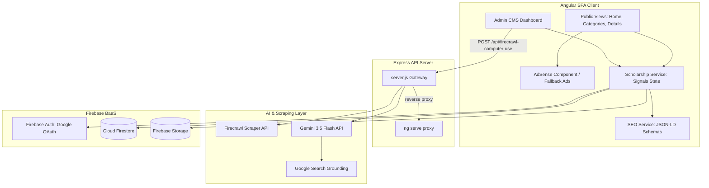

# Scholarupdate - Project Overview

**Date:** 2026-05-21
**Type:** Academic Sourcing Engine & Media Platform
**Architecture:** Decoupled Angular SPA Frontend + Node/Express Middleware API + Firebase Cloud Firestore

---

## Executive Summary

Scholarupdate reduces the transaction cost of finding trustworthy, timely, and verified international academic funding opportunities. Rather than treating users as traffic to be blasted with generic ad placements, the platform is designed as an **academic matching engine disguised as a media brand**. 

The public blog and categories pages serve as high-relevance SEO doorways. The core utility is the curated scholarship directory database, matching student profiles directly to active awards. The administrative portal features an autonomous AI crawler agent that automatically scrapes target university and scholarship index pages, extracts criteria, deadline dates, funding values, and structured markdown descriptions, and structures them into valid opportunities ready for admin publishing.

---

## Project Classification

- **Repository Type:** Standalone Monorepo (Client Angular SPA and API Server)
- **Project Type(s):** Web Application, CMS Dashboard, Web Scraper, AI Agent Gateway
- **Primary Language(s):** TypeScript (Client Frontend), JavaScript (ES Modules, Backend Node Server)
- **Architecture Pattern:** client-server with Firebase BaaS (Backend-as-a-Service) integrations

---

## Technology Stack Summary

| Layer | Component / Technology | Purpose |
|---|---|---|
| **Client Core** | Angular 19+ | Single Page Application framework supporting standalone declarations |
| **Client State** | Angular Signals | Reactive state management for authorization, catalog index, toast notifications |
| **Client Icons** | Angular Material Icons | Navigation and terminal visual alerts |
| **Client Style** | TailwindCSS + PostCSS | Modern responsive aesthetics with dark-accent layout parameters |
| **API Server** | Node.js + Express.js | API middleware, local Angular proxy gateway, and AI crawler router |
| **Web Crawler** | Firecrawl API | Converts raw HTML nodes of target portals into clean Markdown |
| **AI Processing** | `@google/genai` | Gemini 3.5 Flash with live Google Search Grounding to extract opportunities |
| **Database** | Firebase Cloud Firestore | NoSQL document storage for scholarships, subscribers, and dynamic configs |
| **Authentication**| Firebase Auth | Google OAuth sign-in with whitelisted administrator domains |
| **Cloud Storage** | Firebase Storage | Image uploads for scholarship banner covers |

---

## Key Features

1. **AI Autonomous Opportunity Finding:** 
   Admins can query search keywords or paste target URLs into the CMS dashboard. The backend combines Firecrawl scraping with a live Gemini 3.5 Flash Google Search Grounding session to discover real, verified, and active international scholarships.
2. **One-Click Admin Autoposting:** 
   The scraper output is schema-validated by Gemini and returned as cards on the admin workspace panel. The admin can verify deadlines, eligibility, and descriptions, and click a single button to synchronize the post into the live Firestore index.
3. **Pristine AdSense Placements & Fallbacks:** 
   Google AdSense ads are placed dynamically (`leaderboard` on homepage, `sidebar` on details, `in-feed` on list views). Empty ad slot layouts and Cumulative Layout Shifts (CLS) are prevented. When the ad script is blocked (adblockers) or AdSense is disabled, high-quality, pre-styled fallback banners (Grammarly, Duolingo, Coursera) are rendered.
4. **Hardened Security Rules:** 
   Zero-trust Firestore security policies are enforced (`firestore.rules`). Admins are verified based on email checks (`aliyusahmad01@gmail.com`, `student.admin@gmail.com`). Public users can write newsletter subscriptions, but are barred from listing subscriber records. Public users can read scholarships, but can only write updates to increment the document `views` counter by `1`.
5. **Dynamic Signals-Based SEO:** 
   The frontend automatically structures and injects page-specific metadata, Open Graph labels, Twitter card headers, and Schema.org JSON-LD structured data blocks into the DOM depending on active search terms, selected categories, and tags.

---

## Architecture Highlights

---

## Development Overview

### Prerequisites
- Node.js (v18 or higher)
- npm (v9 or higher)
- Firebase Project (optional, defaults to local localStorage demo mode)
- API Keys: `GEMINI_API_KEY`, `FIRECRAWL_API_KEY` (optional)

### Key Commands
- **Install Dependencies:** `npm install`
- **Run Developer Server & Reverse Proxy:** `npm run dev` (spins up Express on port 3000 and reverse proxies Angular CLI on port 4200)
- **Compile Production Code:** `npm run build` (builds Angular distribution files into `dist/app/browser`)
- **Start Backend Production Server:** `node server.js`

---

## Documentation Map

For detailed information, see:
- [index.md](./index.md) - Master documentation index
- [architecture.md](./architecture.md) - Detailed technical architecture and data flows
- [source-tree-analysis.md](./source-tree-analysis.md) - Directory structures and file definitions
- [component-inventory.md](./component-inventory.md) - Pages, layout components, and shared components
- [development-guide.md](./development-guide.md) - Step-by-step developer setup and configurations

---

_Generated using BMAD Method `document-project` workflow_
